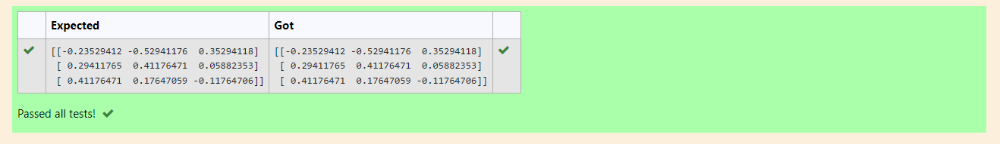

# INVERSE-OF-A-MATRIX
## Aim:
To write a python program to find the inverse of a matrix
## Equipment’s required:
1. 	Hardware – PCs
2. 	Anaconda – Python 3.7 Installation / Moodle-Code Runner
## Algorithm:
### Step1 : Import the numpy module to use te built-in functions for calculation
### Step 2: Enter the elements of the matrix
### Step 3: Using sol=np.linalg.inv(A), we can find the inverse of the matrix
### Step 4: Print the rank of the matrix

## Program:
~~~
#Program to find the inverse of a matrix.
#Developed by: Kiran J
#RegisterNumber: 21500363
import numpy as np
A=np.array([[1,0,3],[-1,2,-2],[2,3,-1]])
sol=np.linalg.inv(A)
print(sol)
~~~
## Output:

## Result:
Thus the inverse of given matrix is successfully solved using python program

